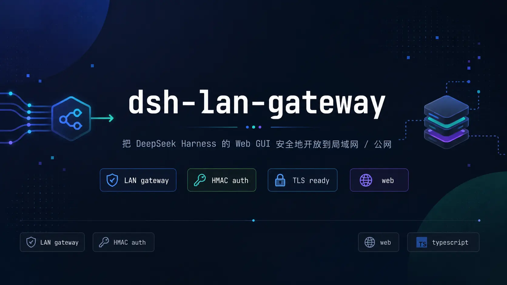
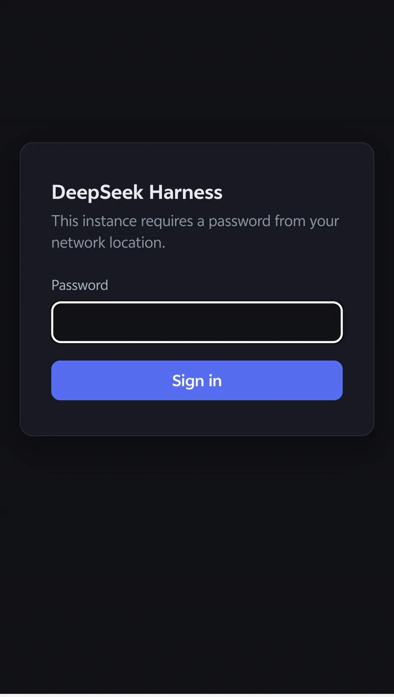

<p align="center">
  
</p>

<h1 align="center">dsh-lan-gateway — LAN / 公网网关插件</h1>

<p align="center">
  
  
  
  
  <a href="https://awesome-dsh-plugin.com"></a>
</p>

`dsh web` 明确拒绝 `--host 0.0.0.0`，以免把远程代码执行暴露到网络。本插件的做法是让 dsh 继续只绑 `127.0.0.1`，另起一个监听 `0.0.0.0` 的反向代理，转发到 loopback 端口并改写 `Host` / `Origin`。

默认拒绝：loopback、LAN、公网三种来源都要先在网关登录页取得 HMAC 会话 cookie，LAN 免密需要显式打开 `lanPasswordless`，默认关闭。底座为 dsh ≥ 0.1.2-rc.1 时（含 QVD-2026-57410 的上游修复），网关在进程内中继一条共享上游会话，上游自身的授权仍然把关每个请求，网关只决定谁可以使用这条会话。

插件另外提供两项功能：

- **不安全源 UUID shim**：网关以纯 HTTP 的局域网地址服务页面，浏览器视其为不安全源，不提供 `crypto.randomUUID`。client bundle 在页面加载早期补一个基于 `getRandomValues` 的实现，工作区才能正常打开。
- **TLS**：自动生成并持久化的自签名证书，或者挂载自行签发的 PEM。自签名证书首次访问会有浏览器警告，属预期行为。

## 安装

已发布到 npm，安装的是预构建产物，不需要 `allowBuilds` 授权。可将下面这段话交给你的 agent：

> 帮我安装 dsh 插件 `@riceawa/dsh-lan-gateway`，遵循
> `https://github.com/rice-awa/dsh-lan-gateway/blob/main/INSTALL.md`

也可以手动执行：

```bash
dsh plugin --profile web add @riceawa/dsh-lan-gateway
```

`dsh plugin ... add` 会把参数转发给 profile 目录里的 pnpm。npm 包自带 `lib/`，不会触发 `ERR_PNPM_GIT_DEP_PREPARE_NOT_ALLOWED`。如果仍然报错，把报错条目写进 `~/.dsh/profiles/web/pnpm-workspace.yaml` 的 `allowBuilds` 后重试，完整步骤见 [INSTALL.md](INSTALL.md#for-agents完整安装流程)。

从源码构建：

```bash
git clone https://github.com/rice-awa/dsh-lan-gateway.git
cd dsh-lan-gateway
pnpm install
pnpm build          # host → lib/index.js
pnpm build:client   # client → lib/client.js
pnpm test           # 93 项
```

仓库里还有一个 [lan-gateway](skills/lan-gateway.md) 技能，安装后可直接在 dsh 对话里说「设置网关密码为 …」「开启远程访问」，agent 会调用 `lan_gateway` 工具完成，密码以参数传入，不写入配置，也不回显。安装方式见 [INSTALL.md](INSTALL.md#for-agents完整安装流程)。

如需在手机 / 平板上访问，可另外安装 [dsh-web-mobile](https://github.com/mexiaosqwq/dsh-web-mobile) 做移动端 UI 适配：

```bash
dsh plugin --profile web add github:mexiaosqwq/dsh-web-mobile
```

## 用法

```bash
lan_gateway enable            # 开启网关（需先满足启动条件，否则给出迁移文案）
lan_gateway status            # 端口 / 目标 / 密码 / 会话 epoch / 中继状态 / 入口加密方式 / 上次错误
lan_gateway set-password      # 设置登录密码（≥8 位，改动会让所有已签发会话立即失效）
lan_gateway rotate-secret     # 轮换会话密钥，作废全部登录 cookie 与已建立的 WebSocket
lan_gateway tls-regenerate    # 换发自签名证书（tlsMode=self-signed 时）
lan_gateway disable           # 关闭
```

`lan_gateway` 是模型可调用的工具，上述命令无需手动执行。直接在对话里说「查看网关状态」「设置网关密码为 ……」即可，密码以参数传给模型，不会写入任何配置文件。

## 配置

所有可调项都暴露为 `lan-gateway` 用户设置命名空间。打开 **DSH 的 Settings → Plugins → 可配置插件**，展开「LAN 网关」卡片即可修改，保存即生效，监听器会按新配置自动重启。下表既是卡片字段，也是配置键：

| 键 | 默认值 | 说明 |
| --- | --- | --- |
| `enabled` | `false` | 是否在启动时监听网络端口 |
| `gatewayPort` | `3081` | 网关监听端口（`0.0.0.0`） |
| `dshTargetPort` | 跟随 `ctx.webServer.port` | 转发到的 dsh loopback 端口 |
| `lanCidrs` | RFC1918 + link-local（见下） | 视为 LAN 的网段，仅在 `lanPasswordless` 开启时用作豁免匹配集 |
| `lanPasswordless` | `false` | LAN/loopback 来源跳过网关登录页（上游会话中继仍把关） |
| `cookieMaxAgeDays` | `7` | 会话 cookie 有效期（天） |
| `cookieName` | `dsh_gw_auth` | 会话 cookie 名，不进卡片 |
| `tlsEnabled` | `false` | 是否以 HTTPS 提供服务 |
| `tlsMode` | `self-signed` | `self-signed` 自动生成 / `custom` 用自己的证书 |
| `tlsSelfSignedHosts` | `localhost` | 自签名证书的 SAN（逗号分隔的域名 / IP） |
| `tlsCertPath` | — | `custom` 模式：PEM 证书（或证书链）绝对路径 |
| `tlsKeyPath` | — | `custom` 模式：PEM 私钥绝对路径 |
| `tlsCertMaxAgeDays` | `825` | 自签名证书有效期（天） |
| `allowInsecurePlaintext` | `false` | 允许明文 HTTP 监听（见下「入口加密」） |
| `trustedTerminator` | — | 声明一个受信 TLS 终止代理标识，视为加密入口（如 `nginx`） |
| `secureCookies` | 自动 | 会话 cookie 的 `Secure` 属性显式开关，默认按 `tlsEnabled` 或 `trustedTerminator` 推断（见下） |

默认 `lanCidrs`：`10.0.0.0/8`、`172.16.0.0/12`、`192.168.0.0/16`、`169.254.0.0/16`。IPv6 的 `fe80::/10`（link-local）与 `127.0.0.0/8`、`::1` 归为 LAN/loopback。

配置里残留 `authRequired: false`（v0.4 及更早的写法）会被启停守卫拒绝并提示迁移，不会静默降级成免密。

### 入口加密

网关默认拒绝纯明文监听，以下三种方式任选其一方可启动：

1. 启用 TLS，`tlsEnabled: true`。推荐，自签名或 custom 证书均可。
2. 声明由可信反向代理终止 TLS：

   ```yaml
   - id: dsh-lan-gateway
     config:
       enabled: true
       gatewayPort: 8080
       trustedTerminator: nginx   # nginx 以 HTTPS 对外，再转发回本端口
   ```

3. 显式接受明文，风险自担，密码与会话会在网内明文传输：

   ```yaml
   - id: dsh-lan-gateway
     config:
       enabled: true
       gatewayPort: 3081
       allowInsecurePlaintext: true
   ```

使用自有证书（例如 Let's Encrypt 签发的 PEM）：

```yaml
- id: dsh-lan-gateway
  config:
    tlsEnabled: true
    tlsMode: custom
    tlsCertPath: /etc/letsencrypt/live/example.com/fullchain.pem
    tlsKeyPath: /etc/letsencrypt/live/example.com/privkey.pem
```

自签名证书在首次启用 TLS 时生成一次，写入 `~/.dsh/lan-gateway/tls/`（`selfsigned.crt` / `selfsigned.key`，0600），之后重启复用。更换证书使用 `lan_gateway tls-regenerate`，它会换掉密钥并热重启监听器。

监听器自身是 HTTPS 时，网关的响应（登录页 / 重定向 / 拒绝）带 HSTS。

### 关于 `Secure` cookie

启用 TLS 或声明受信终止代理后，登录 cookie 自动带 `Secure`。但「声明了受信代理」只说明网关前方存在一个代理，不说明浏览器到代理这一段是加密的。

如果该代理只做明文鉴权、浏览器以 `http://` 访问（代理再以明文转发回本端口），自动推断会把 `Secure` 加上，而浏览器拒收明文 http 上的 Secure cookie。结果是密码校验通过、cookie 无法保存，每次都被重定向回 `/__login`，无限循环。这种部署需要显式关闭：

```yaml
- id: dsh-lan-gateway
  config:
    enabled: true
    gatewayPort: 8080
    trustedTerminator: nginx
    secureCookies: false   # 浏览器 → nginx 是明文 http，不能带 Secure
```

`lan_gateway status` 会如实报告实际生效的属性，以及声明的代理属于 TLS 还是明文入口。设置页里对应「自动 / 始终 Secure / 不加 Secure」三档。

注意 `secureCookies: false` 说的是浏览器到入口这一段是明文，网关登录密码和会话 cookie 会在这一段明文传输。这与 `allowInsecurePlaintext` 描述的不是同一段链路：后者指代理到网关之间不加密，前者指浏览器到代理之间不加密。只有当代理本身已经对用户完成鉴权、且可以接受这段明文时，才应这样配置。

## 安全模型

- **来源分级只认 `socket.remoteAddress`**（IPv4-mapped IPv6 会先解包），分 loopback / lan / internet 三档，绝不信任 `X-Forwarded-For`。分级本身不授予任何访问，每一档默认都要出示有效网关会话，否则 302 到 `/__login`。
- **LAN 免密是显式 opt-in**。`lanPasswordless: true` 只让命中 `lanCidrs` 或 loopback 的来源跳过网关自己的登录页；底座 ≥ 0.1.2-rc.1 时上游会话仍把关每个请求。底座没有浏览器会话认证时这个开关拒绝启用，否则等同于把 QVD-2026-57410 原样恢复。
- **共享上游会话中继**（dsh ≥ 0.1.2-rc.1）。dsh 不再信任回环 Host，要求出示 HMAC 签名的 `dsh-auth-*` cookie。插件经 `connection` 服务拿到启动令牌，在回环传输上做一次浏览器等价的令牌换取，取得 cookie 后中继到每个转发请求；上游一旦 401 就丢弃这条会话并重新换取。这仍是「单密码 = 单操作者」：通过网关登录的用户共用同一条上游会话，持钥的上游才是真正的授权主体。
- **登录页**。`/__login` 由网关独占、不转发。密码以 scrypt 校验，每写一次重新加盐；登录尝试按来源限流（5 次 / 分钟）。
- **会话 cookie** 是 `payload.signature` 结构（HMAC-SHA256），带撤销 epoch，`HttpOnly; SameSite=Strict`。改密、清密、`rotate-secret` 都会递增 epoch，作废全部已签发 cookie 并断开已建立的 WebSocket，客户端需要重新登录。清空密码会直接停止监听。
- **管理面不外泄**。`/lan-gateway/*`（含配置路由）由网关独占、一律 403 不转发，远程访问者无法借网关改写 Host 触及本机 loopback 的配置接口。原生 `/lan-gateway/config` 只应答回环 Host 且同源的请求。远程管理走 `lan_gateway` 工具。
- **CSRF 围栏**（HTTP 与 WebSocket）。网关把 Origin 改写回 loopback，会蒙蔽 dsh 自身的 CSRF 防线，所以在改写前对每个转发请求自检：`sec-fetch-site: cross-site` 直接拒；Origin 必须匹配访问者实际使用的网关权威来源；状态变更方法与 WebSocket 升级请求必须携带同源 Origin，否则 403。
- **未设置密码时拒绝监听**，与来源无关。

## 登录页

远程来源打开 `http://<主机>:3081/` 时先看到网关自带的登录表单，输入正确密码后签发会话 cookie 并跳转回 `/`。

<p align="center">
  
</p>

## UUID shim

网关以 `http://<LAN-IP>:3081` 服务页面，浏览器视其为不安全源，`crypto.randomUUID()`（仅安全源可用）为 `undefined`，于是每次 RPC id 铸造都抛 `crypto.randomUUID is not a function`，工作区无法打开。

client bundle 在模块级给 `Crypto` 原型补一个基于 `crypto.getRandomValues()` 的 `randomUUID`（RFC 4122 v4，`getRandomValues` 在所有源都可用）。它在浏览器求值时就执行，早于任何官方代码铸造 id，所以对官方所有调用点（含以后新增的）一律生效，无需修改 DSH 源码。安全源和 Node ≥ 19 下是 no-op，不影响任何行为。

## 开发

```bash
pnpm test        # 93 项
pnpm typecheck   # tsc 双端（host + client）
```

```
✓ tests/gateway.test.ts               (27) 分类 / HMAC cookie / epoch / 密码状态 / 限流
✓ tests/start-guard.test.ts           (19) fail-closed 启动守卫 / 配置路由回环围栏 /
                                           Secure cookie 属性推断（含 null 清除路径）
✓ tests/integration/gateway.test.ts   (17) 真实网关端到端：全来源登录 / LAN 豁免 /
                                           跨站 403 / 升级拒绝 / cookie 属性 / epoch 撤销 / 会话中继
✓ tests/uuid-shim.test.ts             ( 3) 不安全源补丁 / 安全源 no-op / v4 正确性
✓ tests/x509.test.ts                  ( 6) 自签名证书 DER/SAN/签名/TLS 握手
✓ tests/tls.test.ts                   ( 7) 证书持久化 / 重生成 / 自定义证书加载
✓ tests/upstream-session.test.ts      ( 8) 真实回环令牌换取：cookie 名匹配 / 拒绝后重换 /
                                           invalidate 重获取 / 日志播报 / 保住已持有会话
✓ tests/settings-card.test.ts         ( 6) 设置页字段编解码：三态 auto ↔ false 不可混淆
```

### 发布

推 `v*` tag 触发 [`.github/workflows/release.yml`](.github/workflows/release.yml)：校验 tag 与 `package.json` 版本一致，跑 typecheck 和 test，发 npm，然后建 GitHub Release 并附上 `pnpm pack` 的 tgz。npm 侧走 Trusted Publishing（GitHub OIDC），仓库里不需要 `NPM_TOKEN` secret。`lib/` 被 gitignore，但 `prepack` 会构建，所以发布产物里始终有编译结果。

首次启用要在 npm 包页面的 Settings → Trusted Publisher 配一次：

| 字段 | 值 |
| --- | --- |
| Organization or user | `rice-awa` |
| Repository | `dsh-lan-gateway` |
| Workflow filename | `release.yml` |
| Environment | 留空 |

配好之前 tag 推送会在 `npm publish` 一步以 403 失败（fail-closed，不会留下半个 Release）。改完不用重新打 tag，重跑那次 run 即可。

本地手动发布走 checkout 里的 `.npmrc` token（该文件不入库）：

```bash
pnpm install --frozen-lockfile
pnpm typecheck && pnpm test
npm publish --access public                       # prepack 自动构建 lib/
git tag -a v0.5.4 -m "…" && git push origin v0.5.4
gh release create v0.5.4 --generate-notes ./*.tgz # 可选：Release + tgz 附件
```

## 安全评估

0.5.0 的默认拒绝模型源自针对 QVD-2026-57410（DSH Web API 的 Host 信任缺陷）的加固，相关文档在 [docs/security/](docs/security/)：

- [LAN 网关安全评估](docs/security/SECURITY-AUDIT.md)：0.4.0 时代的 F1–F5 审计快照与 13 个隔离观察，顶部标注了 0.5.0 的修复状态。
- [QVD-2026-57410 修复方案](docs/security/qvd-2026-57410-fix-plan.md)：方案全文 + §15 实施状态。
- [上游研究](docs/security/qvd-2026-57410-research.md)：公开通告、上游提交与版本核对。
- [0.5.4 复审与修复清单](docs/security/audit-2026-09-19-fix-list.md)：0.5.3 的实现细节复审（G1–G8）与修复记录。

## 许可

[MIT](./LICENSE)

各版本改了什么见 [CHANGELOG.md](CHANGELOG.md)。
